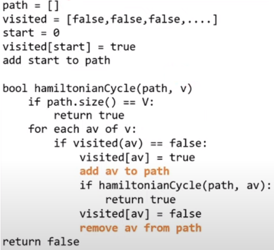

## [Epsilon-Greedy Q-learning](https://www.baeldung.com/cs/epsilon-greedy-q-learning)

```java
State = [
    isDirectionRight, isDirectionLeft, isDirectionDown, isDirectionUp,
    isAppleRight, isAppleLeft, isAppleDown, isAppleUp,
    isCollidingRight, isCollidingLeft, isCollidingDown, isCollidingUp
]

Action in [0, 1, 2, 3]
dY, dX = [[0, 1], [0, -1], [1, 0], [-1, 0]][Action] <--> dY, dX = [Right, Left, Down, Up][Action]

// Exploration
if random() < epsilon
    choose random action
// Exploitation
else
    choose action that maximizes Q[current_state][action]
```

* The more the AI trains, the more rewards we get (see console.log)
* The Q table and training infos are persisted in local storage

## [Hamiltonian Path with DFS](https://www.hackerearth.com/practice/algorithms/graphs/hamiltonian-path/tutorial/)


